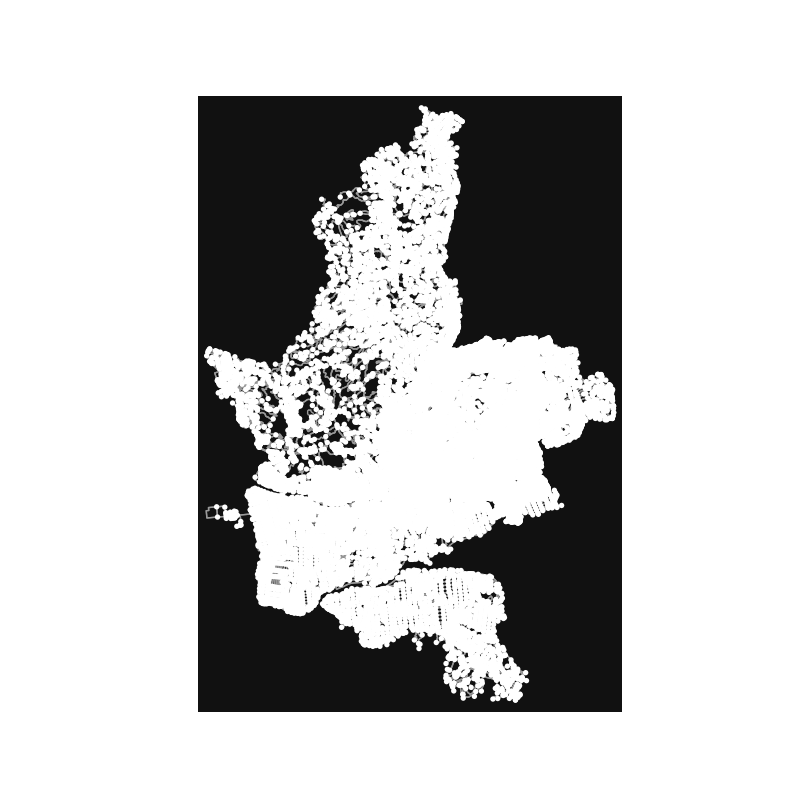
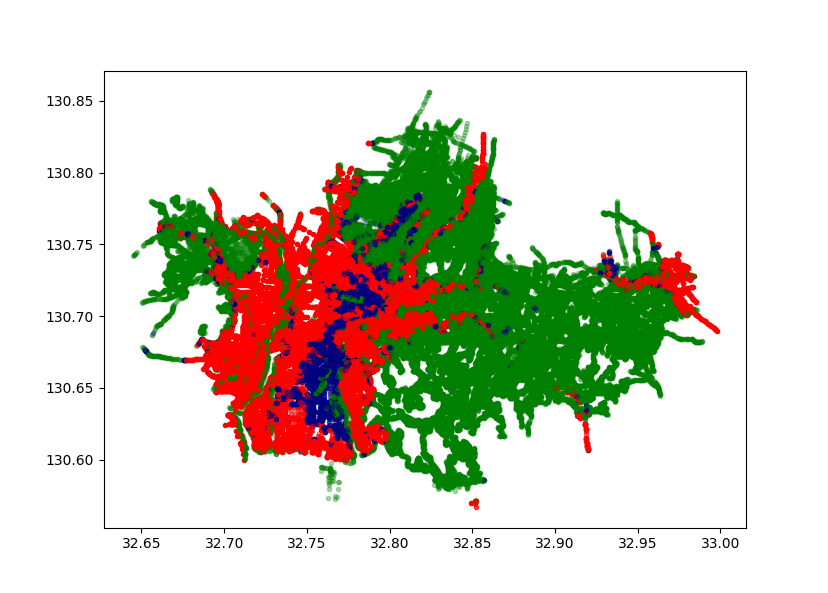

# osmnx GSI

## GSI
GSIは国土地理院の略称です．日本国土に関する地理情報APIを提供しています．

GSI means The Geospatial Information Authorit of Japan.
This institute provides some useful API about geographic, for exmple flood-API.

## osmnx GSI
Open Street Mapはフリーライセンスの地図データを公開している組織です．osmnxはそのOSMをPythonで扱うためのライブラリです．
osmnx-GSIは国土地理院が提供しているAPIとosmnxライブラリを連携させ，日本地理に特化した地図情報のインタフェースとなるようなライブラリです．

Open Street Map is most popular free licence map and osmnx(https://github.com/gboeing/osmnx) that is the library on Python. 
osmnx-GSI is the combination with osmnx library and GSI's API.
This geographic library is  specialized in Japan Map, basecally.
We would use to study about disaster what is happend in Japan 

<a href="gsi/README.md">osmnx GSI document </a>
- This is simple osmnx plot data.

- Here, kumamto city' s hazard map made by GSI-API and osmnx.
